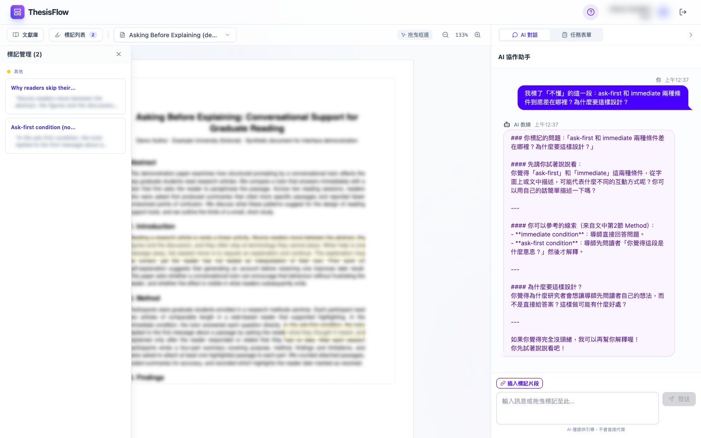
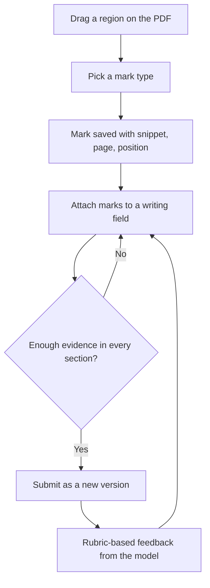
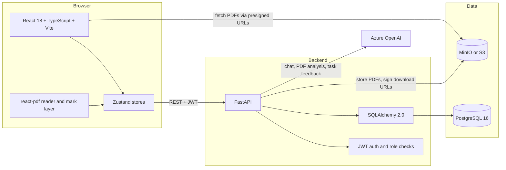

# ThesisFlow

English | [繁體中文](README.zh-TW.md)

A literature-review workspace for master's students, where an AI reading coach asks before it explains and every sentence a student writes has to point back to something they highlighted in the paper.



_The student workspace, running on demo data. Left: the student's marks. Centre: the PDF reader (paper text blurred on purpose). Right: the AI coach answering a "confused" question by asking first._

## The problem

First-year master's students are told to "go read the literature" and mostly end up with a folder of PDFs and a page of loosely paraphrased notes. Two things tend to go wrong:

- They write summaries that cannot be traced back to the paper, so neither they nor their advisor can tell comprehension from guesswork.
- When they get stuck they ask a chatbot, get a fluent answer, and skip the part where they were supposed to think.

ThesisFlow turns the [SALSA framework](https://www.ncbi.nlm.nih.gov/pmc/articles/PMC1538584/) (Search, Appraisal, Synthesis, Analysis) into a concrete workflow. A teacher configures the reading tasks for a class; students read, mark, discuss with an AI coach, and write, all in one screen; the teacher sees how the class is actually reading.

It was deployed and used in a graduate course and research-lab setting. I built it as a solo developer between December 2025 and January 2026.

## What it does

### For students

- **One workspace, side by side.** PDF reader, AI coach, writing tasks and the evidence list live in a single multi-panel screen, so reading and writing are not separate activities.
- **Learning marks, not just highlights.** Dragging a region on the PDF offers five mark types: _confused_, _key point_, _discuss with AI_, _check reference_, and _bookmark_. Each mark is saved with its snippet, page and position, shows up in the evidence list, and can be dropped into the chat or attached to a writing field.
- **Evidence-backed writing.** Two task types ship today: a single-paper summary (purpose, method, findings, limitations by default) and a two-paper comparison matrix. Every field stores its text together with the IDs of the marks that support it.
- **Versioned submissions with AI feedback.** Each submission is saved as a new version and gets rubric-based feedback from the model.
- **Auto-save** on a one-second debounce for writing and task state, plus guided product tours for first-time users.

### For teachers

- **Task configuration per project.** Turn the summary and comparison tasks on or off, edit the summary sections and comparison dimensions, write guidance, and set the minimum number of evidence items each section requires. A live preview shows what students will see.
- **Class management.** Cohorts with join codes, single and bulk student account creation, and membership management.
- **Learning analytics per cohort.** Task progress matrix, activity trend and timeline, evidence statistics, document usage, per-page reading heatmap, editing depth, a word cloud of what students write (segmented with jieba for Chinese), AI feedback summary, and the chat logs themselves.

## Highlight 1: an AI coach that asks first

The coach is not a general-purpose chatbot with a PDF attached. Its behaviour is a teaching decision, written into the system prompt in `backend/routes/chat.py`:

1. **Ask first.** When a student marks something as confused or asks a question, the coach first asks what they think the passage means, in their own words.
2. **Then explain.** Only if the student has no idea does it explain, starting from context clues inside the paper.
3. **Check understanding** after explaining.
4. **Cite the paper**: specific passages and page numbers.
5. **Point out misreadings** gently.

The prompt also carries explicit don'ts (do not hand over complete answers, do not think on the student's behalf), and a response budget so the coach does not lecture.

What the model sees on each turn:

| Context | Source |
| --- | --- |
| The task the student is working on and the teacher's guidance for it | Project configuration |
| The full PDF currently open | Downloaded from object storage, sent as a file input (50 MB cap) |
| The marks the student attached to the message: name, snippet, page, document | Evidence list |
| The student's current draft | Task widget state |

Every exchange is stored per user and project together with the document and marks it referred to. The teacher-side analytics are computed from these chat records, the marks, and saved task states.

One honest caveat: when a PDF is attached, the request carries the PDF and the current message but not the prior turns. The recent-history window (last 8 messages) is only used on the no-PDF path. See [Known limitations](#known-limitations).

## Highlight 2: the evidence chain

The rule the product enforces is simple: you cannot submit a claim you have not tied to the text.


```mermaid
flowchart TD
    A["Drag a region on the PDF"] --> B["Pick a mark type"]
    B --> C["Mark saved with snippet, page, position"]
    C --> E["Attach marks to a writing field"]
    E --> G{"Enough evidence in every section?"}
    G -- "No" --> E
    G -- "Yes" --> H["Submit as a new version"]
    H --> J["Rubric-based feedback from the model"]
    J --> E
```

- The minimum evidence count is set by the teacher, per section or as a project default.
- The checklist is visible the whole time, so students see exactly which section is still unsupported.
- The feedback rubric itself checks for evidence. For the summary task, one of the five criteria is whether each field cites a specific passage.

The gate currently lives in the client. The API stores what it receives and does not re-validate evidence counts; that is on the list below.

## Architecture


```mermaid
flowchart LR
    subgraph CLIENT["Browser"]
        UI["React 18 + TypeScript + Vite"]
        STORE["Zustand stores"]
        PDF["react-pdf reader and mark layer"]
    end

    subgraph SERVER["Backend"]
        API["FastAPI"]
        AUTH["JWT auth and role checks"]
        ORM["SQLAlchemy 2.0"]
    end

    subgraph DATA["Data"]
        PG[("PostgreSQL 16")]
        S3[("MinIO or S3")]
    end

    LLM["Azure OpenAI"]

    UI --> STORE
    PDF --> STORE
    STORE -- "REST + JWT" --> API
    API --> AUTH
    API --> ORM
    ORM --> PG
    API -- "store PDFs, sign download URLs" --> S3
    UI -- "fetch PDFs via presigned URLs" --> S3
    API -- "chat, PDF analysis, task feedback" --> LLM
```

- **Frontend:** React 18, TypeScript, Vite, Zustand, Tailwind CSS, react-pdf, Recharts, Framer Motion. API calls go through a service layer into the store; components read from the store.
- **Backend:** FastAPI on Python 3.11, SQLAlchemy 2.0, PostgreSQL 16, JWT auth with two roles (teacher, student). Around 65 endpoints across 12 routers.
- **Storage:** PDFs are uploaded through the API into MinIO/S3. The reader fetches them straight from the object store with short-lived presigned URLs.
- **Deployment:** three containers via Docker Compose (nginx-served frontend, backend, postgres).

## How it was built

I built this with Claude Code as the implementer and myself as the person who decides what gets built and what is allowed. Many commits in the history carry a Claude co-author trailer; I would rather explain the method than hide it.

What I owned:

- **The product and teaching decisions.** The ask-first coaching strategy, the five mark types, which tasks exist and what their rubrics check, and the late-January rework of the marking and coaching flow in response to feedback.
- **The architecture calls**, including reversing one of my own (see the RAG row below).
- **The constraints the AI works under**, all checked into the repo:
  - [`CLAUDE.md`](CLAUDE.md) describes the architecture and sets git guardrails: no merge, push or force-push without my explicit consent.
  - [`docs/AI_DOCUMENTATION_GUIDE.md`](docs/AI_DOCUMENTATION_GUIDE.md) defines how docs must be kept in sync with code.
  - ESLint, Prettier and a Husky pre-commit hook gate every commit, human or AI.
  - Feature branches and pull requests for the larger changes (monorepo restructure, lint setup, RAG, tour system).

What this taught me is mostly visible in [Known limitations](#known-limitations): AI-assisted speed makes it easy to leave a superseded architecture lying around, and guardrails on git did not substitute for tests.

## Technical decisions

| Decision | Why | Cost |
| --- | --- | --- |
| Built a RAG pipeline (ChromaDB, embeddings, chunking), then removed it ten days later and sent the whole PDF to the model instead | The coach is scoped to the paper that is open, and the model can read a PDF directly. Dropping retrieval removed a vector store, an embedding deployment and a processing-status UI, and left less to maintain | 50 MB per-file cap, higher per-request token cost, no cross-paper retrieval. The original staged plan is kept in [`docs/system-refactor-plan.md`](docs/system-refactor-plan.md) |
| Presigned URLs for reading PDFs | The reader streams files straight from the object store instead of proxying them through the API | The browser needs network access to the object store. Uploads still go through the API as multipart |
| Replaced the free-form workflow canvas with two fixed, configurable tasks | Setup became a form with a live student preview, and students got a fixed task panel instead of node-by-node navigation | Less flexible; the old canvas code is still in the tree |
| One main Zustand store plus small auth and tour stores | One place to look for state in a small team of one | `store.ts` is over 800 lines and due for slicing |
| Hand-written SQL migrations plus `create_all` at startup | Fast to get going without Alembic | No migration history or downgrade path |
| `tenacity` retries on connect and read timeouts to the model API | A transient network error should not surface to a student as a failed conversation | Retries can stack latency on a slow request |

## Engineering practices

What is actually in place:

- ESLint (typescript-eslint, react-hooks, import ordering) and Prettier, enforced by Husky + lint-staged on commit.
- Conventional commit messages and PR-based merges for larger changes.
- Centralised FastAPI exception handlers that return generic 500s in production and tracebacks only when `DEBUG=true`.
- Environment-driven CORS: localhost is allowed in development; production origins come from configuration.
- Health checks for the database container and health endpoints for frontend and backend.
- Documentation that tracks the code: [site map](docs/SITE_MAP.md), [tour system](docs/TOUR_SYSTEM.md), [deployment](docs/DOCKER_DEPLOYMENT.md), [change verification checklist](docs/SystemChangeVerificationGuide.md).

## Known limitations

Things you will find if you read the code, and what I would do about them:

- **No automated tests and no CI.** Verification was manual, guided by a written checklist. If I restarted, I would begin with API tests around submissions and chat context, and a Playwright path through mark → evidence → submit.
- **The evidence gate is client-side only.** The API records every submission as valid. Server-side validation against the project's configuration is the first fix I would make.
- **Mark types stop at the UI.** The data model has columns for mark type, note, AI explanation and a resolved flag, plus a `learning_history` table, but no endpoint writes them yet. Whichever of the five types a student picks, the mark is stored as generic evidence.
- **Chat with a PDF attached has no memory of earlier turns.** The PDF path and the history path use different API calls and were never merged.
- **The chat panel shows raw Markdown.** The coach answers in Markdown and the panel prints it as plain text, which you can see in the screenshot above.
- **Leftovers from superseded designs.** An older copy of the student interface, the React Flow canvas nodes, an earlier chat panel with quick-reply buttons and a synthesis task widget are still in the tree but not routed. RAG tables, a RAG log endpoint, and the `chromadb` and `pymupdf` requirements also remain. One unused frontend dependency (`@google/genai`) should go.
- **`StudentInterface.tsx` is close to 3,000 lines.** Hooks and sub-components have started moving out into `components/student/`, but the split is unfinished.
- **Registration is open and accepts a role.** Anyone who can reach the API can sign up as a teacher. Fine for a closed deployment, not for a public one.
- **Object deletion is a stub.** Deleting an upload returns success without removing the object from storage.
- **The backend container runs as root.**

## Status

Main development ran from December 2025 to January 2026. The project is not under active development; I keep it public as a record of how I design and ship an AI-centred product end to end.

## Running it

You need Docker with the Compose plugin, an Azure OpenAI deployment, and an S3-compatible bucket (MinIO works).

```bash
cp .env.example .env      # fill in Azure OpenAI, MinIO and JWT_SECRET
docker compose up -d
```

- Frontend: http://localhost:3000
- API docs: http://localhost:8000/docs

Tables are created on first start. Register a teacher account, create a cohort and a project, then join as a student with the cohort code.

Local development without Docker, the full environment variable reference and troubleshooting are in [docs/DEVELOPMENT.md](docs/DEVELOPMENT.md).

## License

[MIT](LICENSE)
