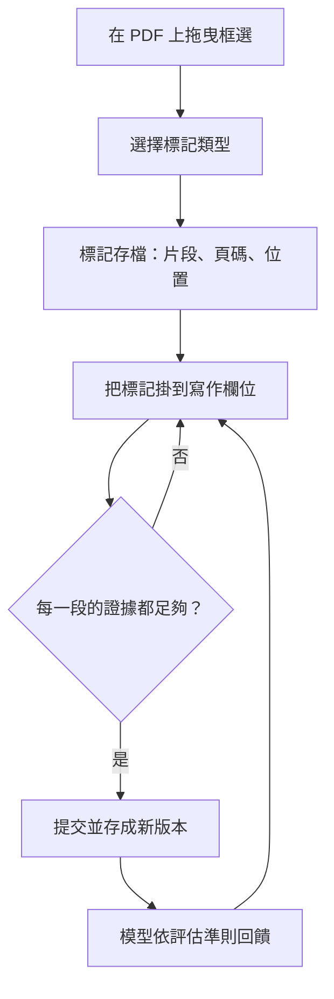
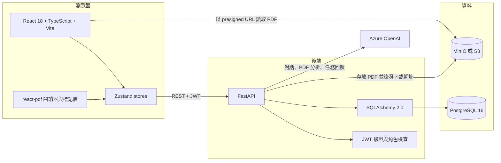

# ThesisFlow

[English](README.md) | 繁體中文

給碩士生用的文獻回顧工作區。裡面的 AI 閱讀教練會先反問、再解釋；學生寫下的每一段話，都要能指回自己在論文上標記過的原文。


_學生工作區，使用示範資料。左：學生建立的標記；中：PDF 閱讀器（論文內文刻意模糊）；右：AI 教練面對「不懂」的提問，先反問而不是直接給答案。_

## 要解決的問題

碩一新生常聽到的一句話是「先去讀文獻」，結果多半是一個塞滿 PDF 的資料夾，加上一頁似是而非的筆記。這套系統針對的是兩個常見狀況：

- 寫出來的摘要對不回原文，學生自己和指導老師都分不出那是讀懂了還是猜的。
- 卡住時去問聊天機器人，拿到一段很通順的答案，於是跳過了本來該自己想的那一步。

ThesisFlow 把 [SALSA 框架](https://www.ncbi.nlm.nih.gov/pmc/articles/PMC1538584/)（Search、Appraisal、Synthesis、Analysis）落成一條具體的流程：教師替班級設定閱讀任務；學生在同一個畫面裡閱讀、標記、和 AI 教練討論、寫作；教師再從另一端看到全班實際上是怎麼讀的。

系統曾部署於研究所課程與實驗室情境中使用。我一個人開發，主要開發期是 2025 年 12 月到 2026 年 1 月。

## 功能

### 學生端

- **一個畫面完成讀與寫。** PDF 閱讀器、AI 教練、寫作任務、證據列表並排在同一個多面板工作區，閱讀和寫作不再是兩件分開的事。
- **學習型標記，不只是螢光筆。** 在 PDF 上拖曳框選後可選五種標記：「不懂」、「重點」、「與 AI 討論」、「看 Reference」、「書籤」。每個標記連同原文片段、頁碼與位置一起存檔，出現在證據列表，可以拖進對話，也可以掛到寫作欄位上。
- **有憑有據的寫作。** 目前提供兩種任務：單篇摘要（預設為研究目的、方法、發現、限制四段）與兩篇論文的比較矩陣。每個欄位除了文字，還一併存下支持它的標記 ID。
- **提交即留版本，並取得 AI 回饋。** 每次提交都存成新版本，模型依評估準則給回饋。
- **自動儲存**（一秒 debounce），以及給第一次使用者的互動式導覽。

### 教師端

- **逐專案設定任務。** 開關摘要與比較任務、編輯摘要段落與比較維度、撰寫引導說明、設定每一段最少需要幾則證據，旁邊即時預覽學生會看到的樣子。
- **班級管理。** 群組與邀請碼、單筆與批次建立學生帳號、成員管理。
- **以群組為單位的學習分析。** 任務進度矩陣、活動趨勢與時間軸、證據統計、文獻使用情況、逐頁閱讀熱圖、編輯深度、學生寫作內容的文字雲（中文以 jieba 斷詞）、AI 回饋彙整，以及對話紀錄本身。

## 亮點一：先反問的 AI 教練

這個教練不是「掛了一份 PDF 的通用聊天機器人」。它的行為是一個教學上的決定，寫在 `backend/routes/chat.py` 的 system prompt 裡：

1. **引導優先。** 學生標記「不懂」或提問時，先問他「你覺得這段可能是什麼意思？用自己的話說說看」。
2. **循序漸進。** 學生表示完全沒概念時才解釋，而且優先從論文本身的上下文找線索。
3. **確認理解。** 解釋完會回頭確認。
4. **引用文獻。** 回答時指出具體段落與頁碼。
5. **指出誤解。** 委婉點出理解可能有誤的地方。

prompt 裡也明寫了不該做的事（不直接給完整答案、不代替學生思考），並限制回覆長度，避免教練變成在講課。

每一輪對話，模型拿到的內容：

| 內容 | 來源 |
| --- | --- |
| 學生正在做的任務，以及教師寫的引導說明 | 專案設定 |
| 目前開啟的整份 PDF | 從物件儲存下載後以檔案輸入送出（上限 50 MB） |
| 學生附在訊息上的標記：名稱、原文片段、頁碼、所屬文獻 | 證據列表 |
| 學生目前的草稿 | 任務元件狀態 |

每一則對話都依使用者與專案存檔，並記下當時討論的文獻與引用的標記。教師端的分析就是從這些對話紀錄、標記，以及儲存下來的任務狀態算出來的。

一個要老實說的地方：附上 PDF 時，請求裡只有 PDF 和當下這則訊息，沒有先前的對話；「最近 8 則歷史」只在沒有 PDF 的路徑上生效。詳見[已知限制](#已知限制)。

## 亮點二：證據鏈

產品想守住的規則只有一條：沒有連回原文的主張，不能提交。



- 最低證據數由教師設定，可以逐段設定，也可以設專案預設值。
- 檢核表全程可見，學生隨時知道哪一段還沒有依據。
- 回饋的評估準則本身也檢查證據。以摘要任務為例，五項準則中有一項就是「每個欄位是否引用了論文中的具體段落」。

這道關卡目前只做在前端。API 收到什麼就存什麼，不會重新驗證證據數量；這件事列在下方的限制裡。

## 架構



- **前端：** React 18、TypeScript、Vite、Zustand、Tailwind CSS、react-pdf、Recharts、Framer Motion。API 呼叫經 service 層進入 store，元件只從 store 讀資料。
- **後端：** FastAPI（Python 3.11）、SQLAlchemy 2.0、PostgreSQL 16、JWT 驗證，兩種角色（教師、學生）。約 65 個端點，分在 12 個 router。
- **儲存：** PDF 經 API 上傳到 MinIO／S3；閱讀器則用短效的 presigned URL 直接向物件儲存讀檔。
- **部署：** Docker Compose 三個容器（nginx 提供的前端、後端、postgres）。

## 怎麼做出來的

這個專案是我和 Claude Code 一起做的：它負責實作，我負責決定要做什麼、以及什麼可以做。git 歷史裡很多 commit 帶著 Claude 的 co-author 標記，與其遮掩，不如把方法講清楚。

由我負責的部分：

- **產品與教學上的決定。** 先反問的教練策略、五種標記類型、有哪些任務、評估準則檢查什麼，以及一月底依回饋對標記與教練流程做的那次改版。
- **架構上的取捨**，包括推翻自己先前的決定（見下表 RAG 那一列）。
- **AI 工作時必須遵守的約束**，全部都放在 repo 裡：
  - [`CLAUDE.md`](CLAUDE.md) 說明架構並設下 git 護欄：未經我明確同意，不得 merge、push、force-push。
  - [`docs/AI_DOCUMENTATION_GUIDE.md`](docs/AI_DOCUMENTATION_GUIDE.md) 規定文件如何與程式碼保持同步。
  - ESLint、Prettier 加上 Husky pre-commit hook，不管是人還是 AI 寫的 commit 都要過。
  - 較大的變更走功能分支與 Pull Request（monorepo 重整、lint 導入、RAG、導覽系統）。

這樣做學到的事，大多寫在[已知限制](#已知限制)裡：AI 讓開發變快，也讓「被取代的舊架構留在原地」變得很容易；而 git 上的護欄，取代不了測試。

## 技術決策

| 決策 | 理由 | 代價 |
| --- | --- | --- |
| 先做了一套 RAG（ChromaDB、embedding、chunking），十天後拆掉，改成整份 PDF 直接送給模型 | 教練的討論範圍就是當下開著的那一篇，而模型本來就能直接讀 PDF。拿掉檢索之後，少了向量資料庫、embedding 部署和處理狀態的 UI，要維護的東西變少 | 單檔 50 MB 上限、每次請求的 token 成本較高、無法跨篇檢索。原本的分階段計畫保留在 [`docs/system-refactor-plan.md`](docs/system-refactor-plan.md) |
| 讀取 PDF 用 presigned URL | 閱讀器直接向物件儲存讀檔，不必經 API 轉送 | 瀏覽器必須連得到物件儲存；上傳仍是 multipart 經過 API |
| 把自由拉線的流程畫布換成兩個固定、可設定的任務 | 教師端的設定變成一張附即時學生預覽的表單；學生端從逐節點導航改為固定的任務面板 | 彈性變小；舊的畫布程式碼還留在 repo 裡 |
| 一個主要的 Zustand store，外加小型的 auth 與 tour store | 一人開發，狀態只需要到一個地方找 | `store.ts` 超過 800 行，該切 slice 了 |
| 手寫 SQL migration，加上啟動時 `create_all` | 不導入 Alembic，起步快 | 沒有 migration 歷史，也沒有降版路徑 |
| 對模型 API 的連線與讀取逾時用 `tenacity` 重試 | 暫時性的網路錯誤，不該讓學生看到一次失敗的對話 | 遇到慢請求時，重試會把延遲疊上去 |

## 工程實務

實際有在做的：

- ESLint（typescript-eslint、react-hooks、import 排序）與 Prettier，由 Husky + lint-staged 在 commit 時強制執行。
- Conventional commit 訊息；較大的變更以 PR 合併。
- FastAPI 集中式例外處理：正式環境只回傳通用的 500，`DEBUG=true` 時才附 traceback。
- 由環境變數決定的 CORS：開發環境放行 localhost，正式環境的來源由設定提供。
- 資料庫容器的 health check，以及前後端各自的 health 端點。
- 跟著程式碼更新的文件：[網站地圖](docs/SITE_MAP.md)、[導覽系統](docs/TOUR_SYSTEM.md)、[部署](docs/DOCKER_DEPLOYMENT.md)、[變更驗證清單](docs/SystemChangeVerificationGuide.md)。

## 已知限制

讀程式碼就會看到的問題，以及我會怎麼處理：

- **沒有自動化測試，也沒有 CI。** 驗證靠的是人工加上一份書面檢查清單。如果重來，我會先寫提交與對話 context 的 API 測試，再用 Playwright 走一遍「標記 → 證據 → 提交」。
- **證據關卡只做在前端。** API 把每一筆提交都記為有效。依專案設定在伺服器端重新驗證，是我第一個會補的東西。
- **標記類型只做到介面這一層。** 資料模型裡已經有標記類型、筆記、AI 解釋、是否已理解這些欄位，也有 `learning_history` 表，但目前沒有任何端點寫入。學生不管選五種裡的哪一種，後端都存成一般證據。
- **附上 PDF 的對話不記得前文。** PDF 路徑和歷史路徑用的是不同的 API 呼叫，一直沒有合併。
- **對話面板直接顯示 Markdown 原始碼。** 教練用 Markdown 回覆，面板卻當成純文字印出來，上面的截圖就看得到。
- **舊設計的殘留。** 舊版的學生介面、React Flow 畫布節點、附快捷回應按鈕的舊對話面板、綜合分析任務元件都還在 repo 裡，但沒有接上路由。RAG 的資料表、一個 RAG 紀錄端點，以及 `chromadb`、`pymupdf` 這兩個依賴也還在。前端另有一個沒用到的依賴（`@google/genai`）該拿掉。
- **`StudentInterface.tsx` 將近 3,000 行。** hooks 與子元件已經開始往 `components/student/` 搬，但還沒拆完。
- **註冊是開放的，而且可以自帶角色。** 任何連得到 API 的人都能註冊成教師。封閉部署還可以，公開部署不行。
- **物件刪除只是空殼。** 刪除上傳檔會回傳成功，但不會真的從儲存移除。
- **後端容器以 root 執行。**

## 現況

主要開發期為 2025 年 12 月到 2026 年 1 月，目前沒有持續開發。我把它公開留著，當作一份紀錄：我怎麼從頭到尾設計並交付一個以 AI 為核心的產品。

## 如何執行

需要 Docker（含 Compose plugin）、一個 Azure OpenAI 部署，以及一個 S3 相容的 bucket（MinIO 即可）。

```bash
cp .env.example .env      # 填入 Azure OpenAI、MinIO 與 JWT_SECRET
docker compose up -d
```

- 前端：http://localhost:3000
- API 文件：http://localhost:8000/docs

資料表會在第一次啟動時自動建立。先註冊一個教師帳號，建立群組與專案，再用群組邀請碼以學生身分加入。

不用 Docker 的本地開發方式、完整的環境變數說明與疑難排解，請見 [docs/DEVELOPMENT.md](docs/DEVELOPMENT.md)。

## 授權

[MIT](LICENSE)
