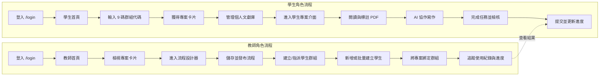
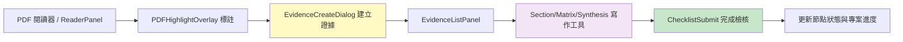

# ThesisFlow 網站地圖

## 📌 文件定位

- 面向實際使用 ThesisFlow 的教師與學生，提供可視化導航與情境說明。
- 輔助支援人員快速回答「這個功能在哪裡？」、「進到任務後還有什麼面板？」等問題。
- 透過 Mermaid 圖同步說明路由、角色旅程與任務串接，方便即時嵌入知識庫或簡報。

---

## 系統概述

ThesisFlow 建立在 SALSA（Search, Appraisal, Synthesis, Analysis）雙循環框架上，以「教師設計教學流程 → 學生依流程完成文獻回顧任務」為核心。系統採用單一登入入口，依角色切換到對應工作臺。

### 角色與入口

- **教師端**：規劃流程、管理學生帳號與群組、監控任務進度。
- **學生端**：加入群組取得專案、管理個人文獻、於 AI 協作介面完成任務。

---

## 網站地圖

### 完整網站結構圖

```mermaid
graph TB
    Start([開始]) --> Login[登入/註冊頁面<br/>/login]

    Login -->|教師登入| TeacherHome[教師首頁<br/>/teacher]
    Login -->|學生登入| StudentHome[學生首頁<br/>/student]

    TeacherHome --> ProjectsHub[教學流程管理]
    TeacherHome --> StudentsHub[學生帳號管理]
    TeacherHome --> CohortsHub[學生群組管理]
    TeacherHome --> DesignerShortcut[開啟流程設計器<br/>/teacher/designer]
    TeacherHome --> CohortDetailPage[群組詳情頁<br/>/teacher/cohorts/:cohortId]

    ProjectsHub --> CRUDProjects[建立/編輯/刪除流程]
    ProjectsHub --> UsageRecords[查看使用紀錄]
    ProjectsHub --> EnterDesigner[進入 React Flow 設計器]

    StudentsHub --> SingleStudentModal[單筆新增/編輯學生]
    StudentsHub --> BulkStudentModal[批量建立帳號]
    StudentsHub --> DeleteStudent[刪除學生帳號]

    CohortsHub --> CreateCohort[建立群組與 9 碼代碼]
    CohortsHub --> SelectCohort[選取群組檢視詳情]
    CohortDetailPage --> BindProject[綁定教學流程]
    CohortDetailPage --> ManageMembers[管理學生名單與進度]
    CohortDetailPage --> CohortUsage[追蹤群組使用紀錄]

    DesignerShortcut --> NodeCanvas[節點畫布]
    NodeCanvas --> NodeConfig[節點設定面板]
    NodeCanvas --> SaveFlow[儲存/佈局流程]
    NodeConfig --> ReadingNode[閱讀引導節點]
    NodeConfig --> SummaryNode[摘要任務節點]
    NodeConfig --> ComparisonNode[比較任務節點]
    NodeConfig --> SynthesisNode[綜合任務節點]

    StudentHome --> ProjectDashboard[專案卡片與進度條]
    StudentHome --> JoinCohort[輸入 9 位數群組代碼]
    StudentHome --> LibraryOverview[文獻庫概覽]

    ProjectDashboard --> EnterProject[進入學生專案<br/>/student/project]
    JoinCohort --> RefreshProjects[刷新可用專案]
    LibraryOverview --> UploadModal[上傳 PDF/文字]
    LibraryOverview --> PreviewModal[PDF/圖片預覽]
    LibraryOverview --> DeleteDoc[刪除文獻]

    EnterProject --> StudentProject[學生專案介面]
    StudentProject --> LibraryPanel[文獻庫面板]
    StudentProject --> ReaderPanel[PDF 閱讀器面板]
    StudentProject --> ChatPanel[AI 聊天助手面板]
    StudentProject --> TasksPanel[任務面板]
    StudentProject --> EvidencePanel[證據列表面板]

    LibraryPanel --> DragBind[拖拉綁定文獻]
    LibraryPanel --> DragUnbind[拖拉解除綁定]
    ReaderPanel --> ViewPDF[檢視/縮放 PDF]
    ReaderPanel --> HighlightText[文字高亮標註]
    ReaderPanel --> CreateEvidence[轉存為證據]
    ChatPanel --> AskQuestion[語境式提問]
    ChatPanel --> WritingTips[AI 寫作建議]
    ChatPanel --> ChatHistory[查看歷史對話]
    TasksPanel --> InstructionCard[InstructionCard 任務說明]
    TasksPanel --> SummaryWriter[SectionWriter 摘要工具]
    TasksPanel --> MatrixCompare[MatrixCompare 比較工具]
    TasksPanel --> SynthesisWriter[SynthesisWriter 綜合工具]
    TasksPanel --> ChecklistSubmit[ChecklistSubmit 節點檢核]
    EvidencePanel --> LinkEvidence[連結證據到任務]

    style Login fill:#e1f5ff
    style TeacherHome fill:#fff4e6
    style StudentHome fill:#e8f5e9
    style DesignerShortcut fill:#fff4e6
    style StudentProject fill:#e8f5e9
    style ChecklistSubmit fill:#c8e6c9
```



### 使用者角色流程圖



### 頁面層級結構圖

```mermaid
graph TD
    Root[/ 根路徑 / ] --> LoginPage[登入頁面<br/>/login]

    LoginPage -->|教師| TeacherRoutes[教師保護路由]
    LoginPage -->|學生| StudentRoutes[學生保護路由]

    TeacherRoutes --> TH[教師首頁<br/>/teacher]
    TeacherRoutes --> TD[流程設計器<br/>/teacher/designer]
    TeacherRoutes --> TC[群組詳情<br/>/teacher/cohorts/:cohortId]

    TH --> TH_Projects[教學流程管理卡片]
    TH --> TH_Students[學生帳號表格]
    TH --> TH_Cohorts[群組清單 + CohortDetail]

    TD --> TD_Canvas[React Flow 節點畫布]
    TD --> TD_Sidebar[節點庫與屬性設定]
    TD --> TD_Tools[儲存、佈局、匯出]

    TC --> TC_Settings[群組設定與邀請碼]
    TC --> TC_Members[成員與進度調整]
    TC --> TC_Usage[使用紀錄表格]

    StudentRoutes --> SH[學生首頁<br/>/student]
    StudentRoutes --> SP[學生專案介面<br/>/student/project]

    SH --> SH_ProjectCards[專案卡片 + 進度條]
    SH --> SH_JoinCard[加入群組卡片]
    SH --> SH_Library[文獻庫概覽 + 預覽/刪除]

    SP --> SP_Library[LibraryPanel 綁定文獻]
    SP --> SP_Reader[PDF 閱讀器 + HighlightOverlay]
    SP --> SP_Chat[ChatMainPanel AI 助手]
    SP --> SP_Tasks[任務面板]
    SP --> SP_Evidence[EvidenceListPanel]

    SP_Tasks --> SP_Tasks_Instruction[InstructionCard]
    SP_Tasks --> SP_Tasks_Summary[SectionWriter]
    SP_Tasks --> SP_Tasks_Comparison[MatrixCompare]
    SP_Tasks --> SP_Tasks_Synthesis[SynthesisWriter]
    SP_Tasks --> SP_Tasks_Checklist[ChecklistSubmit]

    style LoginPage fill:#e1f5ff
    style TeacherRoutes fill:#fff4e6
    style StudentRoutes fill:#e8f5e9
```

---

## 頁面功能說明

### 共用：登入/註冊頁面 (`/login`)

**功能說明：**

- 單一入口，支援登入與註冊模式切換。
- 註冊時可選擇教師或學生角色，並填寫姓名、Email、密碼。
- 登入成功後依角色自動導向 `/teacher` 或 `/student`，未授權路由會被重導回此頁。

---

### 教師端

#### 1. 教師首頁 (`/teacher`)

**功能說明：** 三分欄儀表板，集中管理流程、學生與群組。使用 `useStore` 取得即時資料，並在側邊欄顯示登入教師資訊與登出按鈕。

**主要區塊：**

- **教學流程管理**：卡片顯示流程標題、學期、AI 節點數與最後編輯時間。操作含：
  - `建立新流程`：先呼叫 `exitProject()`，再導向 `/teacher/designer` 開始空白畫布。
  - `編輯`：進入選定流程後開啟設計器。
  - `紀錄`：觸發 usage modal，列出學生提交的任務類型與時間。
  - `刪除`：具備確認提示。
- **學生帳號管理**：表格顯示姓名、帳號、Email、角色。提供：
  - 單筆新增/編輯 modal（可重設密碼）。
  - 批量新增 modal，可設定班級標籤、Email 前綴、網域、座號範圍、密碼與補零位數。
  - 刪除帳號操作。
- **學生群組管理**：左側群組列表 + 右側 `CohortDetail`。
  - 支援依序選取群組查看詳情。
  - `建立群組` 按鈕會開啟 modal，自動生成 9 位數邀請碼。
  - 區塊說明引導教師連結流程與追蹤使用情形。

#### 2. 流程設計器 (`/teacher/designer`)

**功能說明：** 由 `TeacherInterface` 組成的 React Flow 畫布，搭配 `CustomNodes` 支援 SALSA 任務節點。教師可視覺化連線節點並設定欄位。

**節點類型：**

- **閱讀引導節點**：輸入閱讀指引內容。
- **摘要 / 比較 / 綜合任務節點**：配置寫作結構與最少證據要求，對應學生端的 `SectionWriter`、`MatrixCompare`、`SynthesisWriter`。
- 節點屬性面板可設定說明、提示、證據條件，並即時儲存到 `useStore`。

**其他工具：**

- `autoLayout` 排版、`SaveFlow` 儲存、`enterProject` 載入既有流程。
- 可以從教師首頁卡片快速進入或離開特定流程。

#### 3. 群組詳情頁 (`/teacher/cohorts/:cohortId`)

**功能說明：** `CohortDetail` 組件提供群組設定、學生管理與活動紀錄的單頁體驗。

**重點功能：**

- **群組設定**：顯示 9 位數邀請碼，支援一鍵複製；下拉選單可綁定某個教學流程並儲存。
- **學生名單**：10 秒輪詢刷新最新成員。教師可搜尋、勾選並透過 modal 將學生加入群組，或調整個別狀態/進度/移除。
- **使用紀錄**：整合 `loadUsageRecords` 的結果，顯示任務類型與提交時間，利於課堂追蹤。
- **新增學生 modal**：具搜尋、全選、清除及批次加入能力。

---

### 學生端

#### 1. 學生首頁 (`/student`)

**功能說明：** 學生工作臺，用於選擇專案、加入群組與管理文獻。

**模組：**

- **我的研究室**：以卡片呈現所有可進入的專案，顯示標籤、目前階段、百分比進度與快捷按鈕。點擊即呼叫 `enterProject()` 並導向 `/student/project`。
- **加入學生群組**：左側輸入框限制為 9 位數字，並在成功加入後重新載入專案與群組列表；右側面板列出已加入群組及代碼。
- **文獻庫概覽**：以清單顯示學生上傳的 PDF/文字檔，支援：
  - 上傳 modal：拖拉或選檔，PDF 使用 `uploadFileDocument`；文字內容則走 `uploadDocument`。
  - 預覽 modal：對 PDF 使用 `react-pdf`，對圖片顯示預覽，或以原文字呈現。
  - 刪除確認 modal，確保誤刪保護。
  - 拖拉上傳時改變框線色，提升互動辨識度。

#### 2. 學生專案介面 (`/student/project`)

**功能說明：** 單頁多面板佈局，整合文獻、閱讀、AI 與任務。資料由 `useStore` 及 `useAuthStore` 提供，確保與教師設計的節點同步。

**主要面板：**

- **LibraryPanel**：側滑面板，列出專案綁定文獻與全域未綁定文獻。
  - 支援拖放將文獻綁定/解除綁定專案，並自動重新載入列表。
  - 可直接上傳 PDF／文字並綁定到當前專案。
- **ReaderPanel**：結合 `PDFSelector`、`PDFHighlightOverlay` 與 `react-pdf`。
  - 具自動縮放、頁面切換與高亮標註功能。
  - 透過 `EvidenceCreateDialog` 將標註轉為證據，並在頁面右側顯示所有標註。
- **ChatPanel (ChatMainPanel)**：
  - 使用 AI 助手回答問題、提供寫作建議。
  - 支援對話歷史與上下文引用（專案、文獻、當前任務）。
  - 內建 `useAutoSave`，輸入會自動儲存，避免訊息遺失。
- **TasksPanel**：依教師流程顯示待辦節點。
  - `InstructionCard` 呈現每個節點的任務說明。
  - `SectionWriter`、`MatrixCompare`、`SynthesisWriter` 分別提供摘要、比較、綜合寫作介面，皆可為每個欄位掛上多個證據（`FieldWithEvidence`）。
  - `ChecklistSubmit` 在任務完成時檢核必填欄位與證據數量，成功後標記節點完成並解鎖下一節點。
- **EvidenceListPanel**：集中管理所有證據，支援檢視、編輯、刪除，並顯示每則證據目前連結到哪些任務欄位。

---

### 證據系統

**核心概念：** 證據是學生從 PDF 標註轉換出的「可重複引用」片段，串連閱讀、寫作與提交流程。系統中的 `EvidenceSelector` 讓學生在每個任務欄位中勾選對應證據，維持邏輯自洽。



**管理操作：**

- 證據可在 `EvidenceListPanel` 重新命名或刪除，並同步更新所有欄位。
- 於 `EvidenceSelector` 中選擇或取消選擇時，會立即更新任務欄位內的引用計數。

---

## 導航流程總結

### 教師典型流程

1. 登入 `/login`。
2. 於教師首頁的「教學流程管理」建立或開啟流程。
3. 在流程設計器中配置閱讀/摘要/比較/綜合節點並儲存。
4. 建立學生群組，取得 9 位數邀請碼。
5. 透過學生帳號管理新增或批量匯入學生。
6. 在群組詳情頁綁定特定流程並加入學生。
7. 監控使用紀錄與學生進度，需要時於流程設計器微調節點。

### 學生典型流程

1. 登入 `/login` 並被導向 `/student`。
2. 於「加入學生群組」輸入教師提供的 9 位數代碼。
3. 從「我的研究室」選取專案卡片，進入 `/student/project`。
4. 在文獻庫面板上傳或綁定必要文獻。
5. 於閱讀器中標註重點並建立證據。
6. 切換至任務面板，使用各種寫作工具並連結證據。
7. 與 AI 助手互動以獲得說明或撰寫靈感。
8. 通過 Checklist 檢核後提交，系統更新進度並解鎖下一節點。

---

## 技術架構說明

- `App.tsx` 使用 React Router v6，並以 `useAuthStore` 驗證使用者，所有 `/teacher/*` 與 `/student/*` 路由皆受保護。
- `store.ts` 為前端狀態中樞，負責載入專案、學生、群組、文件與使用紀錄。
- 任務寫作元件（`SectionWriter`、`MatrixCompare`、`SynthesisWriter`）與聊天面板皆結合 `useAutoSave`，確保內容在輸入後 1 秒內自動儲存。
- `backend/main.py` 啟用 FastAPI，對應 `/api` 路徑提供認證、文件、專案與使用紀錄 API。

---

## 注意事項

1. **群組代碼**：固定為 9 位數字，教師可在 `CohortDetail` 中複製；學生端會自動濾除非數字字元。
2. **文獻上傳**：PDF 以檔案儲存供 `react-pdf` 預覽；文字檔會直接保存內容供搜尋。
3. **拖放綁定**：學生在 LibraryPanel 拖曳文獻至專案區即可建立關聯，反向拖曳至「全域庫」則解除綁定。
4. **證據引用**：未連結證據的任務欄位會在 `ChecklistSubmit` 中被標記，無法提交。
5. **自動儲存**：聊天輸入與寫作欄位皆自動儲存，若關閉瀏覽器再回來，會從最後一次自動儲存點還原。
6. **即時刷新**：教師端的群組詳情每 10 秒刷新一次，方便觀察剛加入的學生與最新進度。

---

**最後更新日期：** 2025 年 12 月  
**文檔版本：** 1.1
