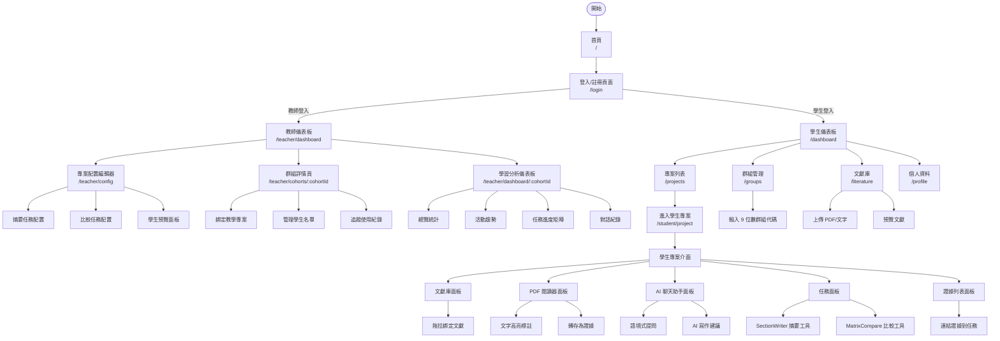
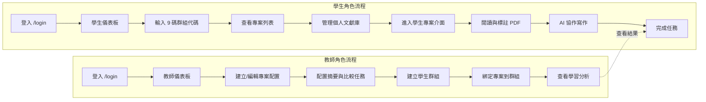
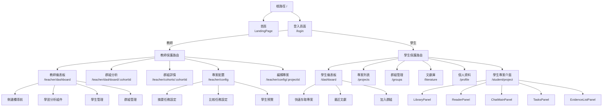
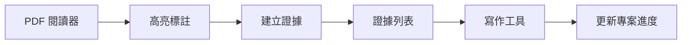

# ThesisFlow 網站地圖

## 📌 文件定位

- 面向實際使用 ThesisFlow 的教師與學生，提供可視化導航與情境說明。
- 輔助支援人員快速回答「這個功能在哪裡？」、「進到任務後還有什麼面板？」等問題。
- 透過 Mermaid 圖同步說明路由、角色旅程與任務串接，方便即時嵌入知識庫或簡報。

---

## 系統概述

ThesisFlow 建立在 SALSA（Search, Appraisal, Synthesis, Analysis）雙循環框架上，以「教師配置專案任務 → 學生依配置完成文獻回顧任務」為核心。系統採用單一登入入口，依角色切換到對應工作臺。

### 角色與入口

- **教師端**：配置專案任務、管理學生帳號與群組、監控任務進度與學習分析。
- **學生端**：加入群組取得專案、管理個人文獻、於 AI 協作介面完成任務。

---

## 網站地圖

### 完整網站結構圖

```mermaid
graph TB
    Start([開始]) --> Landing[首頁<br/>/]
    Landing --> Login[登入/註冊頁面<br/>/login]

    Login -->|教師登入| TeacherDashboard[教師儀表板<br/>/teacher/dashboard]
    Login -->|學生登入| StudentDashboard[學生儀表板<br/>/dashboard]

    TeacherDashboard --> ProjectConfig[專案配置編輯器<br/>/teacher/config]
    TeacherDashboard --> CohortDetail[群組詳情頁<br/>/teacher/cohorts/:cohortId]
    TeacherDashboard --> AnalyticsDashboard[學習分析儀表板<br/>/teacher/dashboard/:cohortId]

    ProjectConfig --> ConfigSummary[摘要任務配置]
    ProjectConfig --> ConfigComparison[比較任務配置]
    ProjectConfig --> PreviewPanel[學生預覽面板]

    CohortDetail --> BindProject[綁定教學專案]
    CohortDetail --> ManageMembers[管理學生名單]
    CohortDetail --> CohortUsage[追蹤使用紀錄]

    AnalyticsDashboard --> OverviewStats[總覽統計]
    AnalyticsDashboard --> ActivityTrend[活動趨勢]
    AnalyticsDashboard --> TaskProgress[任務進度矩陣]
    AnalyticsDashboard --> ChatLogs[對話紀錄]

    StudentDashboard --> ProjectsPage[專案列表<br/>/projects]
    StudentDashboard --> GroupsPage[群組管理<br/>/groups]
    StudentDashboard --> LiteraturePage[文獻庫<br/>/literature]
    StudentDashboard --> ProfilePage[個人資料<br/>/profile]

    ProjectsPage --> EnterProject[進入學生專案<br/>/student/project]
    GroupsPage --> JoinCohort[輸入 9 位數群組代碼]
    LiteraturePage --> UploadDoc[上傳 PDF/文字]
    LiteraturePage --> PreviewDoc[預覽文獻]

    EnterProject --> StudentProject[學生專案介面]
    StudentProject --> LibraryPanel[文獻庫面板]
    StudentProject --> ReaderPanel[PDF 閱讀器面板]
    StudentProject --> ChatPanel[AI 聊天助手面板]
    StudentProject --> TasksPanel[任務面板]
    StudentProject --> EvidencePanel[證據列表面板]

    LibraryPanel --> DragBind[拖拉綁定文獻]
    ReaderPanel --> HighlightText[文字高亮標註]
    ReaderPanel --> CreateEvidence[轉存為證據]
    ChatPanel --> AskQuestion[語境式提問]
    ChatPanel --> WritingTips[AI 寫作建議]
    TasksPanel --> SummaryWriter[SectionWriter 摘要工具]
    TasksPanel --> MatrixCompare[MatrixCompare 比較工具]
    EvidencePanel --> LinkEvidence[連結證據到任務]
```

### 使用者角色流程圖

```mermaid
flowchart LR
    subgraph TeacherFlow[教師角色流程]
        T1[登入 /login] --> T2[教師儀表板]
        T2 --> T3[建立/編輯專案配置]
        T3 --> T4[配置摘要與比較任務]
        T4 --> T5[建立學生群組]
        T5 --> T6[綁定專案到群組]
        T6 --> T7[查看學習分析]
    end

    subgraph StudentFlow[學生角色流程]
        S1[登入 /login] --> S2[學生儀表板]
        S2 --> S3[輸入 9 碼群組代碼]
        S3 --> S4[查看專案列表]
        S4 --> S5[管理個人文獻庫]
        S5 --> S6[進入學生專案介面]
        S6 --> S7[閱讀與標註 PDF]
        S7 --> S8[AI 協作寫作]
        S8 --> S9[完成任務]
    end

    T7 -.->|查看結果| S9
```

### 頁面層級結構圖

```mermaid
graph TD
    Root[根路徑 /] --> LandingPage[首頁<br/>LandingPage]
    Root --> LoginPage[登入頁面<br/>/login]

    LoginPage -->|教師| TeacherRoutes[教師保護路由]
    LoginPage -->|學生| StudentRoutes[學生保護路由]

    TeacherRoutes --> TD[教師儀表板<br/>/teacher/dashboard]
    TeacherRoutes --> TD_Cohort[群組分析<br/>/teacher/dashboard/:cohortId]
    TeacherRoutes --> TC[群組詳情<br/>/teacher/cohorts/:cohortId]
    TeacherRoutes --> TConfig[專案配置<br/>/teacher/config]
    TeacherRoutes --> TConfigEdit[編輯專案<br/>/teacher/config/:projectId]

    TD --> TD_Sidebar[側邊欄導航]
    TD --> TD_Analytics[學習分析組件]
    TD --> TD_StudentMgmt[學生管理]
    TD --> TD_CohortMgmt[群組管理]

    TConfig --> TConfig_Summary[摘要任務設定]
    TConfig --> TConfig_Comparison[比較任務設定]
    TConfig --> TConfig_Preview[學生預覽]

    StudentRoutes --> SH[學生儀表板<br/>/dashboard]
    StudentRoutes --> SP[專案列表<br/>/projects]
    StudentRoutes --> SG[群組管理<br/>/groups]
    StudentRoutes --> SL[文獻庫<br/>/literature]
    StudentRoutes --> SPf[個人資料<br/>/profile]
    StudentRoutes --> SI[學生專案介面<br/>/student/project]

    SH --> SH_QuickAccess[快速存取專案]
    SH --> SH_RecentDocs[最近文獻]
    SH --> SH_JoinGroup[加入群組]

    SI --> SI_Library[LibraryPanel]
    SI --> SI_Reader[ReaderPanel]
    SI --> SI_Chat[ChatMainPanel]
    SI --> SI_Tasks[TasksPanel]
    SI --> SI_Evidence[EvidenceListPanel]
```

---

## 頁面功能說明

### 共用：登入/註冊頁面 (`/login`)

**功能說明：**

- 單一入口，支援登入與註冊模式切換。
- 註冊時可選擇教師或學生角色，並填寫姓名、Email、密碼。
- 登入成功後依角色自動導向 `/teacher/dashboard` 或 `/dashboard`，未授權路由會被重導回此頁。

---

### 教師端

#### 1. 教師儀表板 (`/teacher/dashboard`)

**功能說明：** 教師管理中心，整合學習分析、學生管理與群組管理功能。使用側邊欄導航切換不同功能區塊。

**主要功能：**

- **學習分析**：顯示學生活動趨勢、任務進度、對話紀錄等分析數據。
- **學生帳號管理**：表格顯示姓名、帳號、Email、角色。提供：
  - 單筆新增/編輯 modal（可重設密碼）。
  - 批量新增 modal，可設定班級標籤、Email 前綴、網域、座號範圍。
  - 刪除帳號操作。
- **學生群組管理**：群組列表與詳情。
  - 支援建立群組，自動生成 9 位數邀請碼。
  - 點擊群組可進入詳情頁或分析頁。

#### 2. 專案配置編輯器 (`/teacher/config`, `/teacher/config/:projectId`)

**功能說明：** 由 `ProjectConfigEditor` 組件提供的專案任務配置介面。教師可配置摘要任務和比較任務的結構。

**主要功能：**

- **摘要任務配置**：設定摘要段落結構、字數要求、證據條件。
- **比較任務配置**：設定比較維度、評估欄位。
- **學生預覽面板**：即時預覽學生端看到的任務介面。
- 支援新建專案（`/teacher/config`）和編輯既有專案（`/teacher/config/:projectId`）。

#### 3. 群組詳情頁 (`/teacher/cohorts/:cohortId`)

**功能說明：** 提供群組設定、學生管理與活動紀錄的單頁體驗。

**重點功能：**

- **群組設定**：顯示 9 位數邀請碼，支援一鍵複製；下拉選單可綁定某個教學專案並儲存。
- **學生名單**：定期刷新最新成員。教師可搜尋、勾選並透過 modal 將學生加入群組，或調整個別狀態/移除。
- **使用紀錄**：顯示任務類型與提交時間，利於課堂追蹤。

#### 4. 群組學習分析 (`/teacher/dashboard/:cohortId`)

**功能說明：** 針對特定群組的學習分析儀表板。

**分析組件：**

- **總覽統計**：活躍學生數、任務完成率、平均進度。
- **活動趨勢**：學生活動時間分布圖表。
- **任務進度矩陣**：各學生各任務的完成狀態。
- **對話紀錄**：學生與 AI 助手的對話記錄。

---

### 學生端

#### 1. 學生儀表板 (`/dashboard`)

**功能說明：** 學生主頁，提供快速存取專案、最近文獻與加入群組功能。

**模組：**

- **快速存取**：顯示進行中的專案卡片，點擊可直接進入專案。
- **最近文獻**：顯示最近上傳或查看的文獻。
- **加入群組**：輸入 9 位數群組代碼加入教師群組。

#### 2. 專案列表頁 (`/projects`)

**功能說明：** 顯示所有可用專案的完整列表。

- 專案卡片顯示標題、進度、狀態標籤。
- 點擊專案進入 `/student/project` 專案工作介面。

#### 3. 群組管理頁 (`/groups`)

**功能說明：** 管理已加入的群組。

- 輸入框限制為 9 位數字，成功加入後重新載入專案列表。
- 列出已加入的群組及其邀請碼。

#### 4. 文獻庫頁 (`/literature`)

**功能說明：** 集中管理所有上傳的文獻。

- **上傳功能**：支援拖拉或選檔上傳 PDF/文字檔。
- **預覽功能**：PDF 使用 `react-pdf` 預覽，圖片直接顯示。
- **刪除功能**：具備確認提示的刪除操作。

#### 5. 個人資料頁 (`/profile`)

**功能說明：** 顯示與編輯個人資料。

- 查看帳號資訊、Email。
- 修改密碼功能。

#### 6. 學生專案介面 (`/student/project`)

**功能說明：** 單頁多面板佈局，整合文獻、閱讀、AI 與任務。資料由 `useStore` 及 `useAuthStore` 提供。

**主要面板：**

- **LibraryPanel**：側滑面板，列出專案綁定文獻與全域未綁定文獻。
  - 支援拖放將文獻綁定/解除綁定專案。
  - 可直接上傳 PDF／文字並綁定到當前專案。
- **ReaderPanel**：結合 `PDFSelector`、`PDFHighlightOverlay` 與 `react-pdf`。
  - 具自動縮放、頁面切換與高亮標註功能。
  - 透過 `EvidenceCreateDialog` 將標註轉為證據。
- **ChatPanel (ChatMainPanel)**：
  - 使用 AI 助手回答問題、提供寫作建議。
  - 支援對話歷史與上下文引用（專案、文獻、當前任務）。
  - 內建自動儲存，避免訊息遺失。
- **TasksPanel**：依專案配置顯示任務。
  - `SectionWriter` 提供摘要寫作介面。
  - `MatrixCompare` 提供比較寫作介面。
  - 每個欄位可掛上多個證據（`FieldWithEvidence`）。
- **EvidenceListPanel**：集中管理所有證據，支援檢視、編輯、刪除。

---

### 證據系統

**核心概念：** 證據是學生從 PDF 標註轉換出的「可重複引用」片段，串連閱讀、寫作與提交流程。系統中的 `EvidenceSelector` 讓學生在每個任務欄位中勾選對應證據。

```mermaid
graph LR
    Read[PDF 閱讀器] --> Highlight[高亮標註]
    Highlight --> EvidenceDialog[建立證據]
    EvidenceDialog --> EvidenceList[證據列表]
    EvidenceList --> Writers[寫作工具]
    Writers --> Progress[更新專案進度]
```

**管理操作：**

- 證據可在 `EvidenceListPanel` 重新命名或刪除，並同步更新所有欄位。
- 於 `EvidenceSelector` 中選擇或取消選擇時，會立即更新任務欄位內的引用計數。

---

## 導航流程總結

### 教師典型流程

1. 登入 `/login`，自動導向 `/teacher/dashboard`。
2. 在儀表板建立新專案或選取既有專案進入配置編輯器。
3. 配置摘要任務和比較任務的結構與要求。
4. 建立學生群組，取得 9 位數邀請碼。
5. 透過學生帳號管理新增或批量匯入學生。
6. 在群組詳情頁綁定專案並加入學生。
7. 透過學習分析儀表板監控學生進度與活動。

### 學生典型流程

1. 登入 `/login`，自動導向 `/dashboard`。
2. 於群組管理頁輸入教師提供的 9 位數代碼加入群組。
3. 從專案列表選取專案，進入 `/student/project`。
4. 在文獻庫面板上傳或綁定必要文獻。
5. 於閱讀器中標註重點並建立證據。
6. 切換至任務面板，使用寫作工具並連結證據。
7. 與 AI 助手互動以獲得說明或撰寫靈感。
8. 完成任務後，進度會自動更新。

---

## 技術架構說明

- `App.tsx` 使用 React Router v6，並以 `useAuthStore` 驗證使用者，所有 `/teacher/*` 與學生頁面路由皆受 `ProtectedRoute` 保護。
- `/teacher` 會自動重導向到 `/teacher/dashboard`。
- `/student` 會自動重導向到 `/dashboard`（Legacy 路由支援）。
- `store.ts` 為前端狀態中樞，負責載入專案、學生、群組、文件與使用紀錄。
- 任務寫作元件（`SectionWriter`、`MatrixCompare`）與聊天面板皆結合自動儲存機制。
- `backend/main.py` 啟用 FastAPI，對應 `/api` 路徑提供認證、文件、專案與使用紀錄 API。

---

## 路由對照表

### 公開路由

| 路由 | 組件 | 說明 |
|------|------|------|
| `/` | `LandingPage` | 系統首頁 |
| `/login` | `LoginPage` | 登入/註冊頁面 |

### 學生端路由

| 路由 | 組件 | 說明 |
|------|------|------|
| `/dashboard` | `Dashboard` | 學生儀表板 |
| `/projects` | `ProjectsPage` | 專案列表 |
| `/groups` | `GroupsPage` | 群組管理 |
| `/literature` | `LiteraturePage` | 文獻庫 |
| `/profile` | `ProfilePage` | 個人資料 |
| `/student/project` | `StudentInterface` | 專案工作介面 |
| `/student` | 重導向 | → `/dashboard` |

### 教師端路由

| 路由 | 組件 | 說明 |
|------|------|------|
| `/teacher/dashboard` | `TeacherDashboard` | 教師儀表板 |
| `/teacher/dashboard/:cohortId` | `TeacherDashboard` | 群組學習分析 |
| `/teacher/config` | `ProjectConfigEditor` | 新建專案配置 |
| `/teacher/config/:projectId` | `ProjectConfigEditor` | 編輯專案配置 |
| `/teacher/cohorts/:cohortId` | `TeacherCohort` | 群組詳情頁 |
| `/teacher` | 重導向 | → `/teacher/dashboard` |

---

## 注意事項

1. **群組代碼**：固定為 9 位數字，教師可在群組詳情頁中複製；學生端會自動濾除非數字字元。
2. **文獻上傳**：PDF 以檔案儲存供 `react-pdf` 預覽；文字檔會直接保存內容供搜尋。
3. **拖放綁定**：學生在 LibraryPanel 拖曳文獻至專案區即可建立關聯，反向拖曳則解除綁定。
4. **證據引用**：任務欄位可連結多個證據，用於支持寫作論點。
5. **自動儲存**：聊天輸入與寫作欄位皆自動儲存，若關閉瀏覽器再回來，會從最後一次儲存點還原。

---

**最後更新日期：** 2026-01-17
**文檔版本：** 2.0
