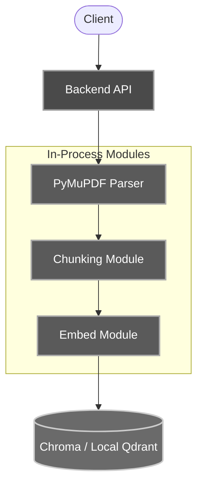
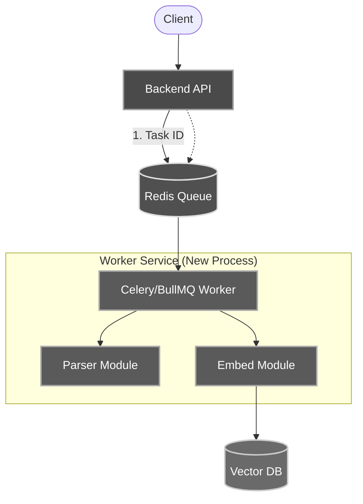
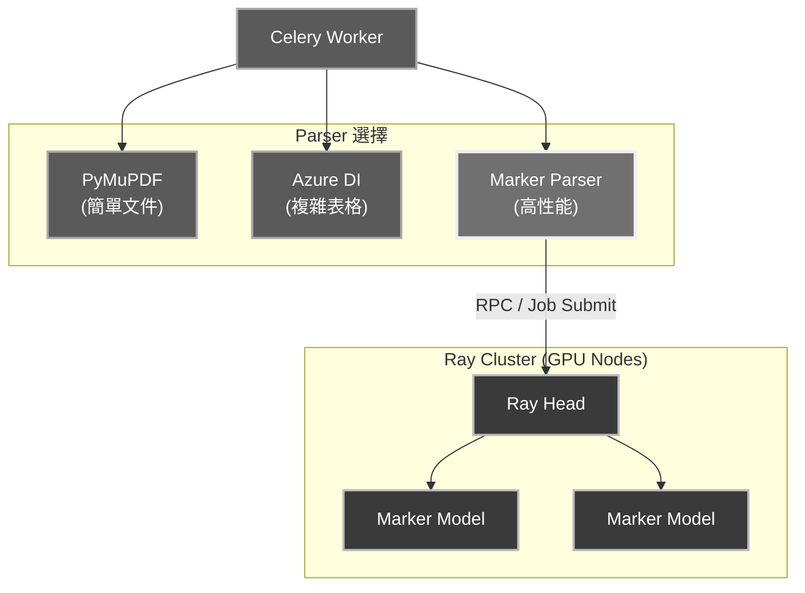
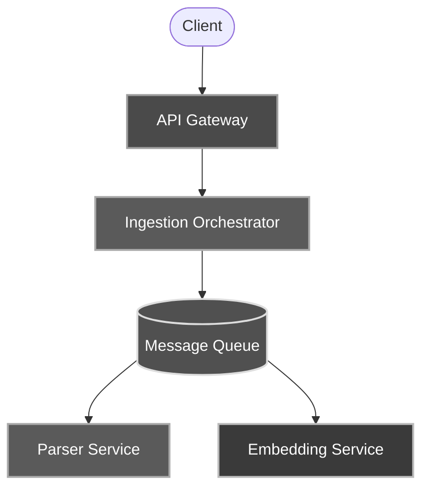

# 漸進式 RAG 實施計畫

**從單體模組化到分佈式集群**

---

## 核心策略

以「簡單直接的實作」開始，先在單體架構內驗證解析品質，再逐步將計算密集型模組剝離為微服務。

### 設計思考：為什麼需要可抽換的 Parser？

在 RAG 系統中，文件解析是核心環節。不同的解析工具各有優劣：

| 工具 | 優勢 | 劣勢 | 適用場景 |
|------|------|------|----------|
| **PyMuPDF** | 快速、免費、本地運行 | 對複雜版面支持較弱 | 簡單文字 PDF |
| **Azure DI** | 高品質、支持表格/圖表 | 需付費、有延遲 | 複雜財報、表格 |
| **Marker** | 極快、支持 GPU 並行 | 需要 GPU 資源 | 大量併發場景 |

**核心問題**：如何設計系統，讓我們能夠：
1. 根據文件類型選擇最合適的解析工具
2. 當某個工具不可用時，快速切換到備用方案
3. 進行 A/B 測試，比較不同工具的解析品質
4. 未來新增更好的工具時，不需要重構整個系統

**解決方案**：建立統一的 Parser 介面

即使階段一只使用 PyMuPDF，我們也要預留擴展空間。核心概念是：
- 所有 Parser 都返回相同格式的結果（content + metadata）
- 上層代碼（Chunking、Embedding）不需要知道用的是哪個 Parser
- 新增 Parser 時，只需要實作相同的介面，無需修改其他代碼

---

## 階段一：模組化單體 MVP (Modular Monolith)

### 基本資訊

| 項目 | 說明 |
|------|------|
| **週期** | 第 1-2 週 |
| **目標** | 在現有 Backend 中引入 RAG，並確立 Parsing 介面標準 |
| **限制** | 不引入 Queue，不引入 Ray |

---

### 1.1 架構視圖

所有的邏輯（Upload, Parse, Embed, Chat）都在同一個 Backend API 進程中。



> **關鍵點**：階段一保持簡單，直接使用 PyMuPDF，專注於驗證 RAG 流程。

---

### 1.2 關鍵行動點

- **實作 PyMuPDF Parser 模組**
  - 建立 `parsers/pymupdf_parser.py`
  - 實作 `parse_pdf(file_path: str) -> dict` 函數
  - 返回格式：`{ "content": str, "metadata": dict, "success": bool }`
  
- **實作 Chunking 模組**
  - 將解析後的長文本切分成適合 Embedding 的小塊
  - 使用簡單的固定長度切分（如 500 字元，overlap 50 字元）
  
- **實作 Embedding 模組**
  - 使用 OpenAI Embedding API 或本地模型（如 sentence-transformers）
  - 將 chunks 轉換為向量
  
- **Vector DB 整合**
  - 使用 Chroma 或本地 Qdrant
  - 儲存 chunks 和對應的向量
  
- **資料庫遷移**
  - 建立 `documents` 表：儲存上傳的文件基本資訊
  - 建立 `document_chunks` 表：儲存切分後的文本塊
  
- **同步處理**
  - 用戶上傳時，API 會 Block 住（等待解析完成）

> 這是暫時可接受的痛點。階段二會引入異步處理。

#### Parser 模組設計思考

雖然階段一只用 PyMuPDF，但要考慮未來擴展性：

```python
# parsers/pymupdf_parser.py
def parse_pdf(file_path: str) -> dict:
    """
    使用 PyMuPDF 解析 PDF
    
    Returns:
        {
            "content": str,      # Markdown 格式的文本
            "metadata": {
                "page_count": int,
                "file_size": int,
                "parse_time": float
            },
            "success": bool,
            "error": str | None
        }
    """
    import pymupdf
    import time
    
    start_time = time.time()
    
    try:
        doc = pymupdf.open(file_path)
        content = ""
        
        for page_num, page in enumerate(doc, start=1):
            text = page.get_text()
            content += f"## Page {page_num}\n\n{text}\n\n"
        
        metadata = {
            "page_count": len(doc),
            "file_size": doc.metadata.get("fileSize", 0),
            "parse_time": time.time() - start_time
        }
        
        doc.close()
        
        return {
            "content": content,
            "metadata": metadata,
            "success": True,
            "error": None
        }
    except Exception as e:
        return {
            "content": "",
            "metadata": {},
            "success": False,
            "error": str(e)
        }
```

**為什麼這樣設計？**

1. **統一的返回格式**：即使未來新增 Azure Parser，也返回相同的 dict 結構
2. **錯誤處理**：`success` 和 `error` 欄位讓上層代碼容易判斷
3. **元數據追蹤**：記錄 `parse_time` 等資訊，方便後續性能分析
4. **獨立模組**：Parser 邏輯獨立，未來可以輕鬆搬到 Worker 或微服務中

---

### 1.3 產出價值

- ✅ 系統「能讀」PDF 了（使用 PyMuPDF 本地解析）
- ✅ 建立了可擴展的介面架構，未來可輕鬆新增其他解析器
- ✅ 驗證了 RAG 的基本流程（Parse → Chunk → Embed → Query）
- ✅ 開始累積解析數據，為後續品質優化打基礎

---

## 階段二：異步工作流與狀態管理 (Async Workflow & State)

### 基本資訊

| 項目 | 說明 |
|------|------|
| **週期** | 第 3-4 週 |
| **目標** | 解決「上傳卡死」問題，引入隊列 |
| **重點** | Parser 代碼完全不變，只是搬家了 |

---

### 2.1 架構視圖

引入 Redis 與 Worker。



> **關鍵點**：這裡複用階段一的代碼，無需重寫 Parser 邏輯。

---

### 2.2 關鍵行動點

- **引入 Celery/BullMQ**
  - 將階段一的 `parse_pdf()` 函數封裝進 Worker Task
  - 代碼幾乎不需要改動，只是執行環境從 API 進程搬到 Worker 進程
  
- **實作簡易狀態機**
  - 在 Redis 中記錄 `task_id: { status: "parsing", progress: 20% }`
  
- **前端改造**
  - 上傳後不再轉圈圈，而是顯示進度條，輪詢後端狀態 API

**代碼遷移範例**：

```python
# 階段一：在 API 中同步執行
@app.post("/upload")
def upload_file(file: UploadFile):
    file_path = save_file(file)
    result = parse_pdf(file_path)  # 直接調用
    chunks = chunk_text(result["content"])
    embed_and_store(chunks)
    return {"status": "success"}

# 階段二：改為異步執行
from celery import Celery
celery = Celery("tasks", broker="redis://localhost")

@celery.task
def parse_and_embed_task(file_path: str):
    result = parse_pdf(file_path)  # 相同的函數！
    chunks = chunk_text(result["content"])
    embed_and_store(chunks)

@app.post("/upload")
def upload_file(file: UploadFile):
    file_path = save_file(file)
    task = parse_and_embed_task.delay(file_path)  # 異步執行
    return {"task_id": task.id, "status": "processing"}
```

---

### 2.3 產出價值

- ✅ 支持大文件上傳（不會 Timeout）
- ✅ 系統架構開始解耦，Web 服務與計算服務分離

---

## 階段三：高性能計算替換 (High-Performance Engine)

### 基本資訊

| 項目 | 說明 |
|------|------|
| **週期** | 第 5-8 週 |
| **目標** | 引入 Marker + Ray (方案 E)，解決 50+ 併發時的解析速度瓶頸 |

---

### 3.1 架構視圖

這是「換引擎」的時刻。我們新增一個 RayParserStrategy。



> **新增的選項**：Marker + Ray 作為高性能解析方案，與現有 Parser 並存。

---

### 3.2 關鍵行動點

- **部署 Ray Cluster**
  - 可以先在單台 GPU 機器上部署 Ray
  
- **實作 Marker Parser 模組**
  - 建立 `parsers/marker_parser.py`
  - 返回相同格式的 dict（與 PyMuPDF 一致）
  - 內部調用 Ray 進行分佈式處理
  
- **頁面級並行**
  - 在 Parser 內部實作「拆分 PDF -> 分發給 Ray -> 合併結果」的邏輯

**代碼範例**：

```python
# parsers/marker_parser.py
import ray

def parse_pdf(file_path: str) -> dict:
    """使用 Marker + Ray 進行高性能解析"""
    if not ray.is_initialized():
        ray.init(address="ray://your-cluster:10001")
    
    try:
        # 提交到 Ray 集群
        result_ref = parse_with_marker.remote(file_path)
        content, metadata = ray.get(result_ref)
        
        return {
            "content": content,
            "metadata": metadata,
            "success": True,
            "error": None
        }
    except Exception as e:
        return {
            "content": "",
            "metadata": {},
            "success": False,
            "error": str(e)
        }

@ray.remote
def parse_with_marker(file_path: str):
    # 調用 Marker 進行解析
    # 這裡會在 GPU 節點上執行
    pass
```

**在 Worker 中使用**：

```python
# 根據文件類型或配置選擇 Parser
if use_high_performance:
    from parsers.marker_parser import parse_pdf
else:
    from parsers.pymupdf_parser import parse_pdf

result = parse_pdf(file_path)  # 介面完全相同！
```

---

### 3.3 產出價值

- ✅ 解析 100 頁 PDF 從「分鐘級」降至「秒級」
- ✅ 具備處理 50 人同時上傳的彈性擴展能力

---

## 階段四：全微服務化 (Full Microservices)

### 基本資訊

| 項目 | 說明 |
|------|------|
| **週期** | 第 3 個月後 (視業務規模而定) |
| **目標** | 團隊分工，獨立部署 |

---

### 4.1 架構視圖

當系統變得太複雜，Worker 裡面的邏輯太多時，將 Worker 拆散。



---

### 4.2 服務說明

#### Ingestion Orchestrator

| 項目 | 說明 |
|------|------|
| **職責** | 取代簡單的 Celery Worker，管理複雜流程 |
| **優勢** | 可視化流程編排，支持重試與錯誤處理 |

#### Parser Service

| 項目 | 說明 |
|------|------|
| **職責** | 獨立部署，專門跑 Ray Adapter 或 Azure SDK |
| **優勢** | 可獨立擴展，不影響其他服務 |

#### Embedding Service

| 項目 | 說明 |
|------|------|
| **職責** | 獨立部署 GPU 服務 |
| **優勢** | GPU 資源隔離，成本可控 |

> 參考 `microservices_rag_architecture_decoupled.md` 的完整圖表

---

## 總結：給您的建議路徑

### 不要試圖一步登天直接做階段四

目前最重要的一步是「階段一」：

> 請立刻在您的 Python/Node.js 後端專案中，建立一個 `parsers/` 目錄，並按照 `modular_parsing_interface_design.md` 把 BaseParser 和 ParserFactory 寫出來。

---

### 這樣做的好處

- **代碼不浪費**
  - 階段一寫的 Parser 邏輯，到階段二、三時，是可以直接 Ctrl+C / Ctrl+V 到 Worker 裡的
  
- **風險最低**
  - 在沒有複雜基礎設施的情況下，您明天就能看到 RAG 的效果
  
- **簡單直接**
  - 不引入過度設計，專注於驗證核心價值

---

## 快速檢查清單

在開始實施前，請確認：

- [ ] 已安裝 PyMuPDF (`pip install pymupdf`)
- [ ] 已選擇 Vector DB（推薦 Chroma 或 Qdrant）
- [ ] 已選擇 Embedding 方案（OpenAI API 或本地模型）
- [ ] 已建立 `documents` 和 `document_chunks` 資料表設計
- [ ] 團隊已達成「先做 MVP，再優化」的共識

---

## 附錄：未來擴展思考

### 當需要新增其他 Parser 時（階段二/三）

如果未來需要新增 Azure DI 或 Marker，建議的做法：

1. **建立新的 Parser 模組**
   ```python
   # parsers/azure_parser.py
   def parse_pdf(file_path: str) -> dict:
       # 使用 Azure Document Intelligence
       # 返回相同格式的 dict
       pass
   ```

2. **建立 Parser 選擇邏輯**
   ```python
   # parsers/__init__.py
   def get_parser(parser_type: str = "pymupdf"):
       if parser_type == "pymupdf":
           from .pymupdf_parser import parse_pdf
       elif parser_type == "azure":
           from .azure_parser import parse_pdf
       else:
           raise ValueError(f"Unknown parser: {parser_type}")
       return parse_pdf
   ```

3. **在 API 層使用**
   ```python
   # api/upload.py
   from parsers import get_parser
   
   parser = get_parser("pymupdf")  # 或從配置讀取
   result = parser(file_path)
   ```

這樣的設計：
- ✅ 保持簡單（沒有複雜的抽象類和工廠模式）
- ✅ 易於擴展（新增 Parser 只需新增一個文件）
- ✅ 易於測試（每個 Parser 都是獨立的函數）
- ✅ 易於遷移（整個 `parsers/` 目錄可以直接搬到 Worker）
